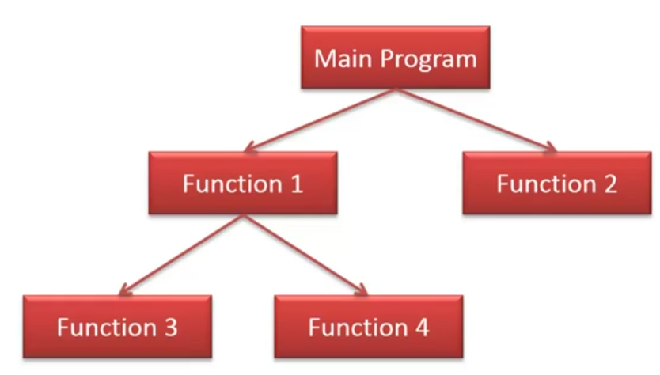
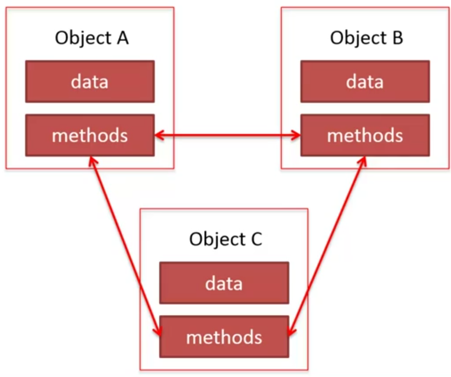
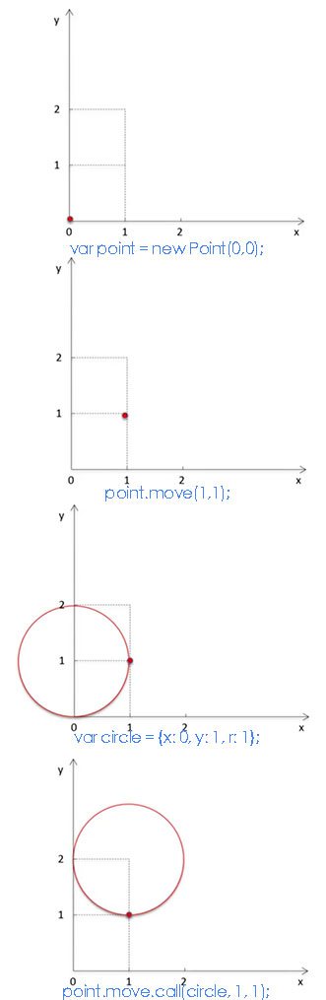

<!-- START doctoc generated TOC please keep comment here to allow auto update -->
<!-- DON'T EDIT THIS SECTION, INSTEAD RE-RUN doctoc TO UPDATE -->
**Table of Contents**  *generated with [DocToc](https://github.com/thlorenz/doctoc)*

- [面向对象](#%E9%9D%A2%E5%90%91%E5%AF%B9%E8%B1%A1)

<!-- END doctoc generated TOC please keep comment here to allow auto update -->

## 面向对象

### 程序设计方法

程序设计描述系统如何通过程序来实现的过程，其为一种设计方法与语言实现无关。常见的设计方法有面向流程与面向对象。

#### 面向过程

以程序的过程为中心，采用自定而下逐步细化的方法来实现。常见的面向过程语言有 C、Fortran、Pascall。



#### 面向对象

将对象作为程序的基本单元，将程序分解为数据和操作的集合。常见的面向过程语言有 smalltalk（也是 Objective-C 的父亲）、Java、C++。



##### 概念

- 类（Class）、对象（Object）
- 属性（Property）、方法（Method）

##### 基本特点

- 继承（Inheritance）
- 封装（Encapsulation）
- 多态（Polymorphism）

## JavaScript 面向对象

### constructor

对象的构造器，也可称之为构造类型。

```javascript
// 使用 new 关键字创建
var o = new Object();
var a = new Array();
var d = new Date();
    |         |
 object    constructor

// 使用直接量创建
var o = {name: 'Xinyang'};
var a = [1, 2, 3];
```

#### 自定义构造器

```javascript
// constructor
function Person(name, age, birthdate) {
  this.name = name;
  this.age = age;
  this.birthdate = birthdate;
  this.changeName = function(newAge) {
    this.age = newAge;
  }
}

// 创建对象
var X = new Person('Stupid', 13, new Date(2015, 01, 01));
var Q = new Person('Q', 12, new Date(2015, 01, 01));

X.changeName('X');
```

##### 创建构造器的方法（3 种）

- `function ClassName() {...}`
- `var Class = function() {...}`
- `var Class = new Function()`

NOTE: 并不是所有函数都可以被当成构造器，例如 `var o = new Math.min()`。通常自定义的函数均可当做构造器来使用。内置对象的构造器也可被当做构造器。

NOTE+：如果构造器有返还值并为对象类型，则对象将被直接返回。

```javascript
function Person(name, age, birthdate) {
  this.name = name;
  this.age = age;
  this.birthdate = birthdate;
  this.changeName = function(newAge) {
    this.age = newAge;
  }
  // !!! 注意这里
  return {};
}

var X = new Person('X', 13, new Date());
console.log(X.name); // undefined;
```

### this

`this` 在不同环境中指代的对象不同（`this` 指代的值可在函数运行过程中发生改变）。

|出现场景|所指代值|
|--------|--------|
|全局环境|全局对象（window 在浏览器环境中时）|
|constructor|创建的新实例对象|
|函数调用|函数的调用者|
|`new Function()`|全局对象|
|`eval()`|调用上下文中的 `this`|

#### 全局环境中

全局环境中 `this` 指代全局对象，既 `window` 在浏览器环境中。

```javascript
// 以下的所有 this 均指代全局对象
var a = 10;
alert(this.a);

this.b = 20;
alert(b);

c = 30;
alert(this.c);
```

#### 构造器中

构造器中的 `this` 指代的是即将被创建出的对象。

```javascript
// constructor
function Person(name, age, birthdate) {
  // 下面的指代即将被创建的对象
  this.name = name;
  this.age = age;
  this.birthdate = birthdate;
  this.changeName = function(newAge) {
    this.age = newAge;
  }
}

// 创建对象
var X = new Person('Stupid', 13, new Date(2015, 01, 01));
var Q = new Person('Q', 12, new Date(2015, 01, 01));

X.changeName('X');
```

#### 函数中

函数中的 `this` 指代函数的调用者。

```javascript
// constructor
function Person(name, age, birthdate) {
  // 下面的指代即将被创建的对象
  this.name = name;
  this.age = age;
  this.birthdate = birthdate;
  this.changeName = function(newAge) {
    this.age = newAge;
  }
  this.gretting = function() {
    // !!! 下面这个 this 指代调用它的对象，既上面的
    // 上面的 gretting 左边的 this，既为即将被创建的对象
    console.log('Hi, I am ' + this.name)
  }
}

// 创建对象
var X = new Person('Stupid', 13, new Date(2015, 01, 01));

X.changeName('X');
X.gretting();
```

NOTE: `new Function('console.log(this)')` 中的 `this` 均指代全局对象。`eval('console.log(this)` 则为调用上下文指代的 `this`。

### this 实例

下面的例子使用 `apply` 与 `call`。通过这两个方法来将一个对象中 `this` 指代的目标进行改变。

```javascript
function Point(x, y) {
  this.x = x;
  this.y = y;
  this.move = function(x, y) {
    this.x += x;
    this.y += y;
  }
}

var point = new Point(0, 0);
point.move(1, 1);

var circle = {x: 0, y: 1, r: 1};

// 改变 point 中 move 方法 this 指代的对象至 circle
point.move.apply(circle, [1, 1]);
// 同样可以用类似的 call 方法，区别为参数需依次传入
point.move.call(circle, 1, 1);
```



### 原型继承

使用原型（prototype）可以解决重复定义实例对象拥有的完全一致的属性或方法（既共享原型中的属性或方法）。

```javascript
function Boss() {
  this.age = 0;
  this.birthdate = null;
  this.name = '';
  this.tasks = [];
  this.title = 'Boss';
  this.gretting = function() {console.log('I am a Boss!');};
}

var X = new Boss();
var Q = new Boss();

// X 与 Q 中具有完全一致（不必唯一的属性或方法）
// 并耗用内存的共享部分
// this.title 与 this.gretting
```

**改造后的构造器**

```javascript
function Boss() {
  this.age = 0;
  this.birthdate = null;
  this.name = '';
  this.tasks = [];
}
Boss.prototype = {
  title: 'Boss',
  gretting: function(){console.log('I am a Boss!');}
}

var X = new Boss();
var Q = new Boss();

// X 与 Q 中具有完全一致（不必唯一的属性或方法）
// 并耗用内存的共享部分
// this.title 与 this.gretting

var X = new Boss();
var Q = new Boss();

// X 与 Q 拥有相同的原型 Boss.prototype
```

### 原型链

使用原型继承的方法会产生原型链。JavaScript 中对于对象的查找、修改和删除都是通过原型链来完成的。

**判断属性是否为对象本身**

```javascript
objectName.hasOwnProperty('propertyName');
// 返回布尔值 true 或 false
```

#### 属性查找

对象的属性查找会更随原型链依次查找，如果在当前环境中无法找到需要的属性则会继续向下一层原型中继续寻找。

#### 属性修改

在 JavaScript 中对于对象属性的修改永远只修改对象自身的属性（不论是来源于对象本身还是对象的原型）。当创建当前对象不存在属性时（即便原型拥有此属性），也会为此对象增加改属性。

**修改原型上的属性**

修改原型属性会印象所有被创建出的对象现有的属性和方法。

```javascript
ClassName.prototype.propertyName = 'new value';
ClassName.prototype.methodName = function(){...};
```

#### 属性删除

`delete objectName.propertyName` 只可删除对象自身的属性，无法删除对象的原型属性。

#### Object.create(proto[, propertiesObject])

其为ECMAScript 5 中提出的新建立对象的方式。在 `X` 中使用隐式的原型对象指向 `boss` 对象，并将其设为 `X` 对象的原型。

```javascript
var boss = {
  title: 'Boss',
  gretting: function(){console.log('Hi, I am a Boss!');}
};

var X = Object.create(boss);
X.gretting(); // Hi, I am a Boss!
```

**低版本中实现 Object.create 功能**

此种方式仍需使用 `ClassName.prototype` 的方式来实现。

```javascript
var clone = (function(){
  var F = function(){};
  return function(proto) {
    F.prototype = proto;
    return new F();
  }
})();
```

### 面向对象的应用
