## 版本控制

版本管理涉及团队协作，产品质量，和产品上线。使用版本控制工具可使我们自由的做的一些几点：

- 回退到任意版本
- 查看历史版本
- 对比两个版本差异


### 版本控制系统

版本控制系统（Version Control System）是一种记录若干文件修订记录的系统，它可以帮助开发者查阅或回档至某个历史版本。

- 手动版本控制
- LVCS 本地
- CVCS 集中式（例如 SVN）
- DVCS 分布式（例如 Git）

**手动版本控制**


无法有效找到需要版本和差异，污染工作目录结构。

**Local VCS 本地式**


于是出现了本地版本控制系统 RCS（Reversion Control System），其利用本地版本数据库存储不断出现的文件版本。
它可以迅速找出需求的版本和维持工作目录结构。其缺点是不支持协同开发，这也让开发者不将其选做通用的版本控制工具来使用。

**CVCS 集中式**


利用中央服务器来管理文件版本，但每一次操作都需要网络请求，且具有致命的单点故障。
（既中央服务器故障可导致，无法协同工作或数据丢失）

**DVCS 分布式**


分布式指的是每一份本地仓库都是一个完整的项目历史拷贝，即使一份仓库丢失或者损坏也可以从其他的仓库中获取此项目的完整历史记录。
也因为在添加新版本不需要网络，这可以使操作流程。

### 分支模型

如果多人并行在一条线上开发会导致开发困难并且难以定位错误位置。


分支，就是从目标仓库获得一份项目拷贝，每条分支都具有和原仓库功能一样的开发线。

分支模型（Branching Model）或称之为工作流（Workflow），它是一个围绕项目
**开发**、**部署**、**测试**等工作流的分支操作（创建及合并等）的规范集合。

#### 产品级开发分支模型

**常驻分支**

- development，从 master 创建
- production（master），默认分支可用于发布的代码

**活动分支**

- feature，从 development，创建其为特性分支
- hotfix，从 master 创建，用于修复 Bug
- release，从 development 创建


#### 环境


- 开发环境，使用测试开发配置（数据库，缓存，元数据配置）
  - 使用提交到下一个 release 的特性分支
- 测试环境，使用测试配置（测试数据库）
  - 使用 release/development
- 预发布环境，小范围发布使用线上数据库模拟真实环境
  - 使用 release
- 生产环境，线上配置
  - 使用 master

### Git

Git 是一个免费开源的分布式版本控制系统，它也一个基于内容寻址的存储系统。
Git 是由 Linux 的创造者 Linus Torvalds。

**优势**

- 速度快，不依赖网络
- 完全分布式
- 轻量级分支操作
- Git 为行业标准版本控制供给
- 活跃和成熟的社区

**安装**

**Mac OS X** 下使用 `brew install git` 下载更新既可。

**Linux Ubuntu** 下可使用 `apt-get install git` 既可。

### Git 介绍

#### Git 命令

常用 Git 命令，当在命令行中键入 `git` 可以便可以在帮助信息中看到。

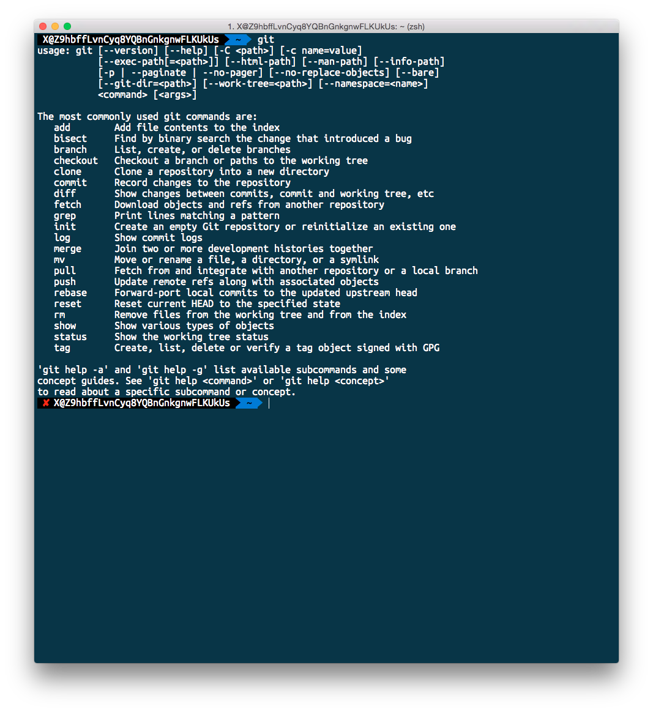

**获取帮助**

`git help <command>` `git <command> -h` `git <command> --help` 还有
`man git-<command>` 均可查询某个命令的帮助文档。

**基本操作**

配置 Git 使用 `git config` 此为创建 Git 仓库前必须完成的配置。

```bash
git config --global user.name "Li Xinyang"
git config --global user.email "lixinyang1026@gmail.com"
```

- --local 默认 具有最高优先级 只影响本仓库 `.git/config`
- --global 中级优先级 影响到所有当前用户的仓库 `~/.gitconfig`
- --system 最低优先级 影响到全系统的仓库 `/etc/gitconfig`

**初始化仓库**


初始化仓库，使用 `git status` 可以查询当前仓库的状态。
如在*未初始化*仓库时查询状态会报出错误信息。

```bash
git init [path]
git init [path] --bare
```

在初始化仓库后会出现一个隐藏的目录 `.git`
其中包括了所有的当前仓库的版本信息和本地设置文件(`.git/config`)。


**查询状态**

`git status` 此命令可以帮助开发者在下面三对关系中找出文件状态的变化。

- 未跟踪   <--> 跟踪
- 工作目录 <--> 暂存区
- 暂存区   <--> 最新提交


Git 中存在两种状态**内容状态**和**文件状态**。
仓库中的文件均可以在状态和区域之间进行转换。

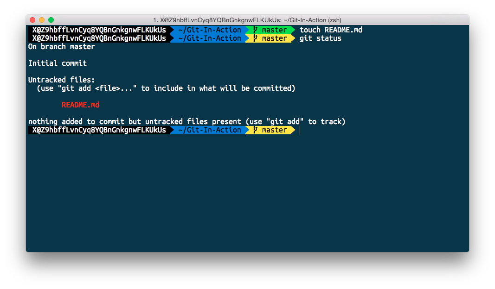

**添加文件到暂存区（同时跟踪文件）**

`git add [file]`


上图所示，我们将 `README.md` 文件从工作区提交至暂存区，
并将文件状态从未跟踪改变成已跟踪。


NOTE：批量增加当前目录下全部文件 `git add .`


**忽略文件**

`.gitignore` 可以在添加至仓库时忽略匹配的文件，但仅作用于*未跟踪*的文件。


NOTE：GitHub 为各个类型项目和操作系统提供了忽略文件模板，
可以在[这里](https://github.com/github/gitignore)找到。

**暂存区删除文件**

使用 `git rm` 可以做到从暂存区删除文件，下面提供几种常用的使用方法：

- `git rm --cached` 仅存暂存区删除
- `git rm` 才暂存区和工作区目录中删除
- `git rm $(git ls-files --deleted)` 删除所有被跟踪但在工作区已经被删除的文件

NOTE：`git-ls-files`
- Show information about files in the index and the working tree

**工作区与暂存区**

不同的区域中可以存在文件的独立版本，如下图所示工作区和暂存区的文件为两个不同的版本。
（之前上个例子中所创建的 `DummyFile` 文件已被删除）


**暂存区**

我们可以把暂存区比作一个每类物品只能放置一次的购物车此外还具有下面的特质：

- 货架和购物车可同时出现同种物品
- 货架上的物品可以替换掉购物车的物品
- 可以删除物品
- 提交购物车完成购买并生成购买记录

其中

- 物品：文件
- 货架：工作目录
- 购物车：暂存区
- 购买：提交内容

**提交版本记录**

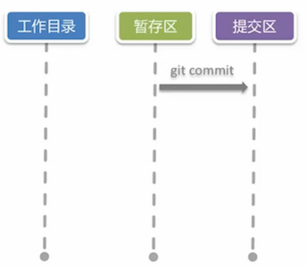

`git commit` 可以根据暂存区的内容创建一个提交目录。


NOTE：直接提交工作区的内容`git commit -a -m 'message'`，工作中不建议这样操作。

**查询提交历史记录**

`git log` 可以用来显示提交是记录信息。

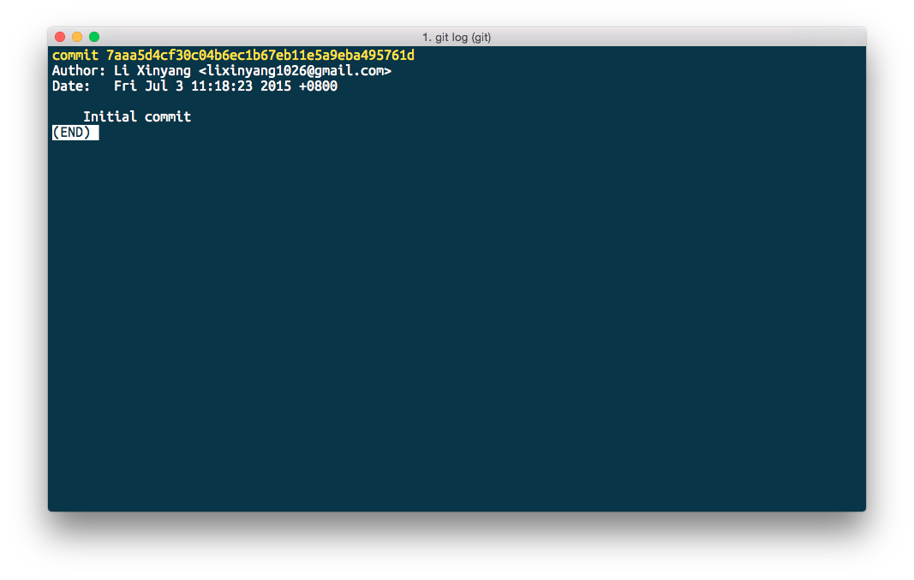

其中包括：

- 提交编号 SHA-1 编码的 HASH 标示符
- git-config 配置的提交者信息
- 提交日期
- 提交描述信息

工作中可使用下面简单的配置进行版本查询

```bash
git log --oneline


# 较长的命令可以使用 alias 的方法简化
git log --color --graph --pretty=format:'%Cred%h%Creset -%C(yellow)%d%Creset %s %Cgreen(%cr) %C(bold blue)<%an>%Creset' --abbrev-commit
```

**Git 中 alias 命令设置**

配置 Git 中别名的方法 `git config alias.shortname <fullcommand>`。

```bash
git config --global alias.lg "log --color --graph --pretty=format:'%Cred%h%Creset -%C(yellow)%d%Creset %s %Cgreen(%cr) %C(bold blue)<%an>%Creset' --abbrev-commit"

git lg
```

NOTE：如果你使用 Mac OS X 可以尝试使用 [Oh My Zsh](http://ohmyz.sh)
其中已经预先设置好了非常多常用别名。

**显示版本差异**


`git diff` 用于显示版本差异，下面是几个常用的方法：

- `git diff` 显示工作目录与暂存区的差异
- `git diff -cached [<reference>]` 暂存区与某次提交的差异（默认为 HEAD）
- `git diff <reference>` 工作目录和某次提交间的差异
- `git diff <reference> <reference>` 查询两次提交直接的差别

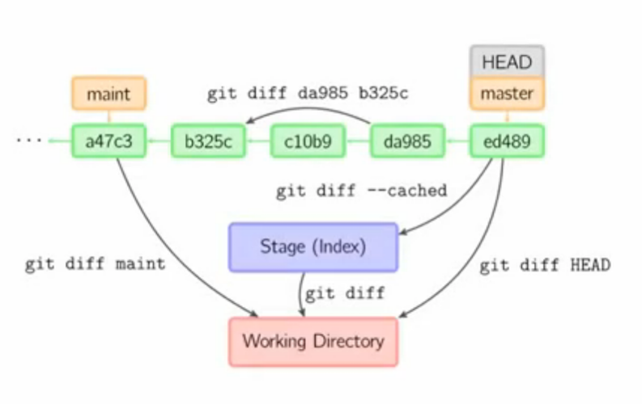

**撤销工作区的修改**

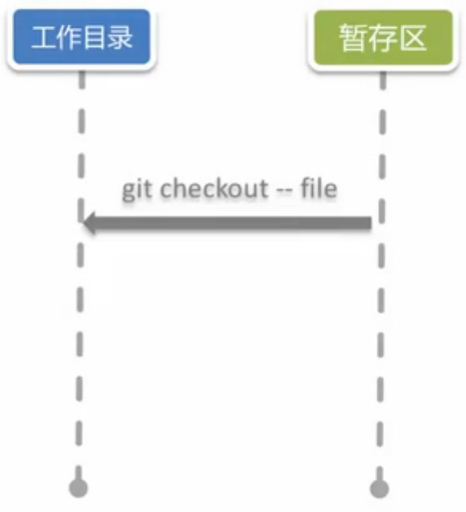

`git checkout -- <file>...` 可用于撤销工作区的修改
（此方法会丢弃工作区修改且**不可恢复**），下面是一些常用方法：

- `git checkout -- <file>` 将文件从暂存区复制到工作目录

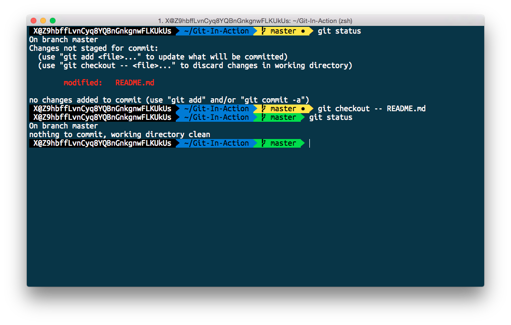

NOTE：使用 `--` 是为了避免路径和引用（或提交 ID）同名发生的冲突。

**撤销暂存区内容**


使用 `git reset HEAD <file>...` 可用于撤销暂存区的修改，下面是一些常用操作：

- `git reset HEAD <file>` 将文件内容存上次提交复制到暂存区。


**撤销全部修改**

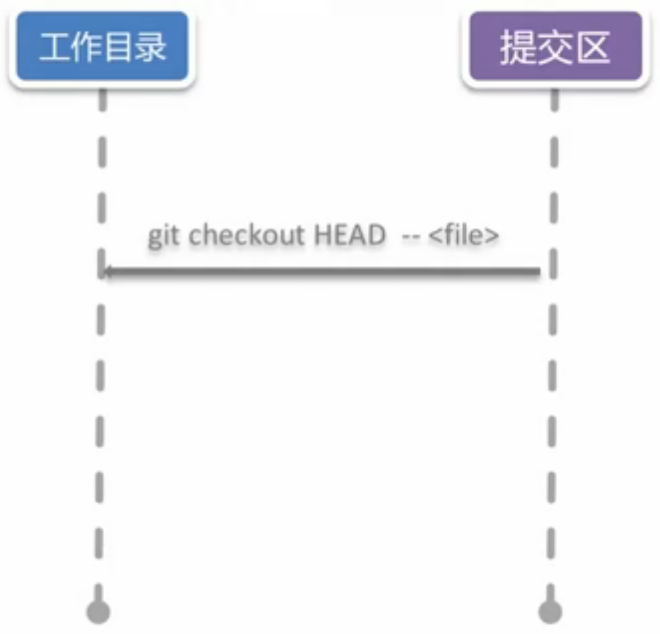

`git checkout HEAD -- <file>` 可以直接将内容从上次的提交复制到工作区。


**命令总结**


#### 分支操作

**git branch**

使用 `git branch` 可以对仓库分支进行增删查改的操作，下面列举了一下常用的操作方式：

- `git branch <branchname>`，创建指定分支
- `git branch -d <branchname>`，删除指定分支
- `git branch -v`，显示所有分支信息

> 一份分支的引用只是一个文本文件，里面只有一个 SHA 编码。它保存于 `.get/refs/heads/master` 中。
>
> —— 郑海波 网易工程师

```bash
git branch next
```

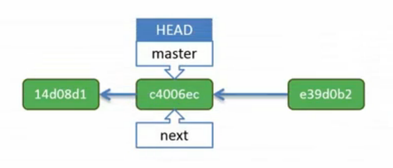

```bash
git commit -m 'message'
```


**切换至目标分支**

`git checkout` 它可以本枝上根据通过移动 HEAD（指向当前的提交） 检测出版本，
也可用于切换分支。（其会把当前的工作目录和暂存区移动到提出分支的版本）
常用命令有：

- `git checkout <branchname>`，使指针指向目标分支
- `git checkout -b <branchname>`，创建目标分支并切换分支
- `git checkout <reference>`，可以指向任何一个版本

```bash
git checkout next
```


NOTE：所有提交是更具 HEAD 向前进的，所以前后分支后则会跟着 Next 分支进行开发。

```bash
git commit -m 'message'
```

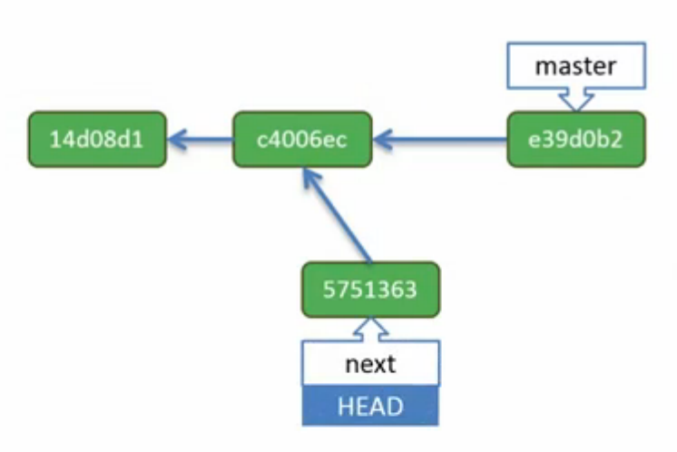

```bash
# -- 为短名与 cd 类似
git checkout --

# 或者使用
# git checkout master
```

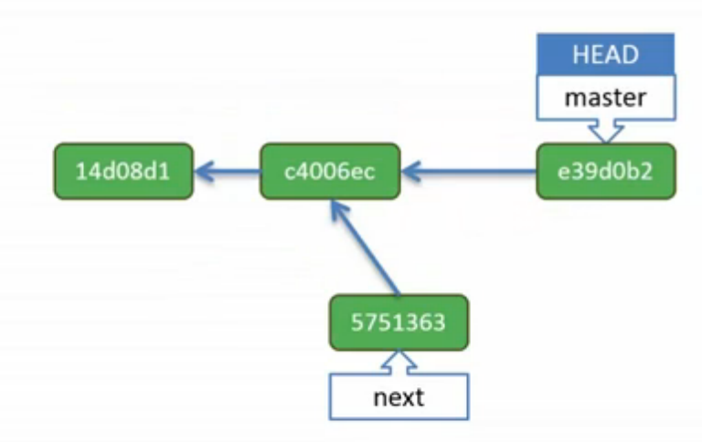

```bash
git checkout -b Issue-26
```


NOTE：使用 `git branch -v` 可以列出全部分支，带 `*`
表示当前所属分支（HEAD 指向分支）。

```bash
git checkout c4006ec
```


当 HEAD 指针与具体的分支分离时，我们将其称之为 `detached head`。
如果 HEAD 在分离状态则因尽量避免在此状态下进行提交，只做内容的查看。

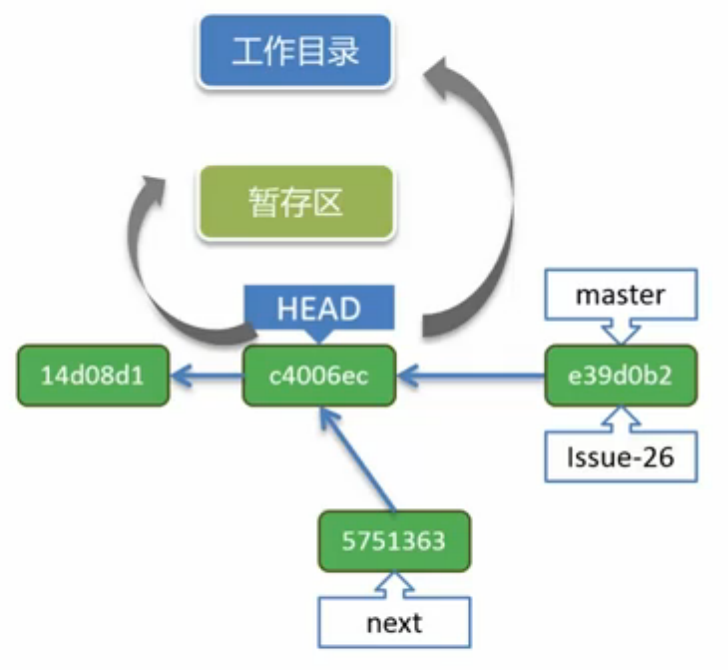

**完全回退**


使用`git reset`可以将当前分支回退到历史中的某个版本，
下面为常用的三种方式（三种的区别是恢复的内容时候同时会恢复的工作区或暂存区）：

- `git reset --mixed <commit>` 默认方式，内容存入暂存区
- `git reset --soft <commit>` 内容存入暂存区和工作区
- `git reset --hard <commit>` 暂存区和工作区保留现有状态

```bash
git reset --mixed e390b3
```

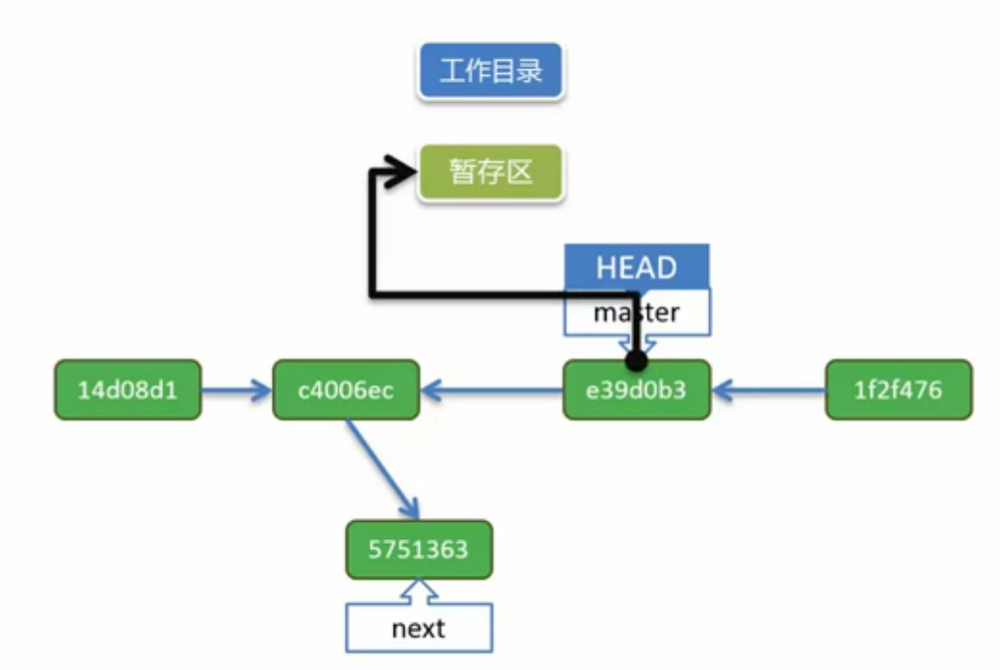

**如果上一个命令如果使用 hard**

```bash
git reset --hard e390b3
```

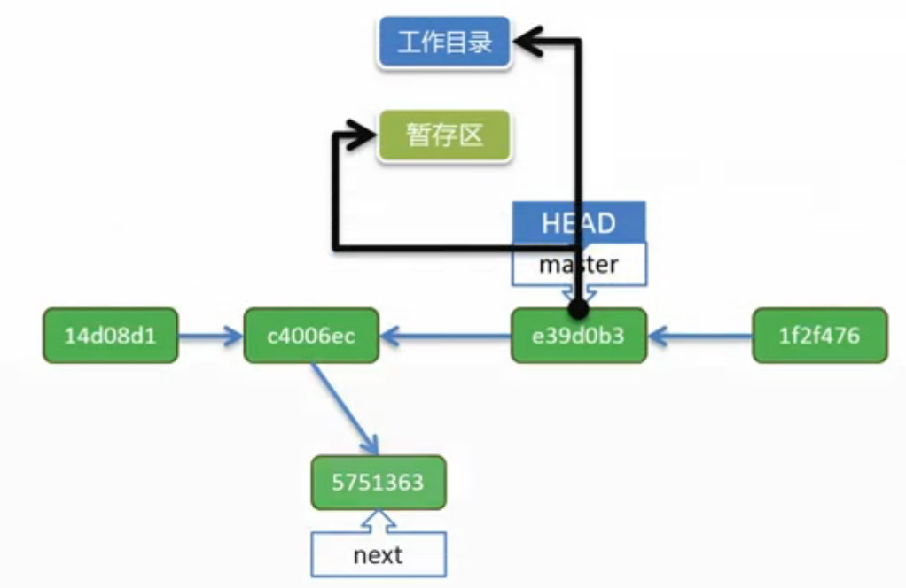

**如果上一个命令如果使用 hard**

```bash
get reset --soft e390b3
```


此方法暂存区和工作目录不会发生任何变化仅仅只是 HEAD 指针发生了变化，
但原有的提交已经无指针指向成为无索引的提交其就有可能被回收。

**查询所有提交记录**

`git reflog` 会根据仓库的提交顺序按顺序来排列，其中包括无索引的提交，
可以在这里使用 HASH 值来进行，但是无索引的提交可能会丢失。

**使用捷径**

`A^` 表示 `A`上的父提交，多个 `^` 可表示以上的多个级别。
`A~n` 则表示在 `A` 之前的第 n 次提交。


##### reset 与 checkout 区别

两种方法都有两个作用范围，一个是分支操作（commit 操作），
另一个是文件操作（file 操作）。
